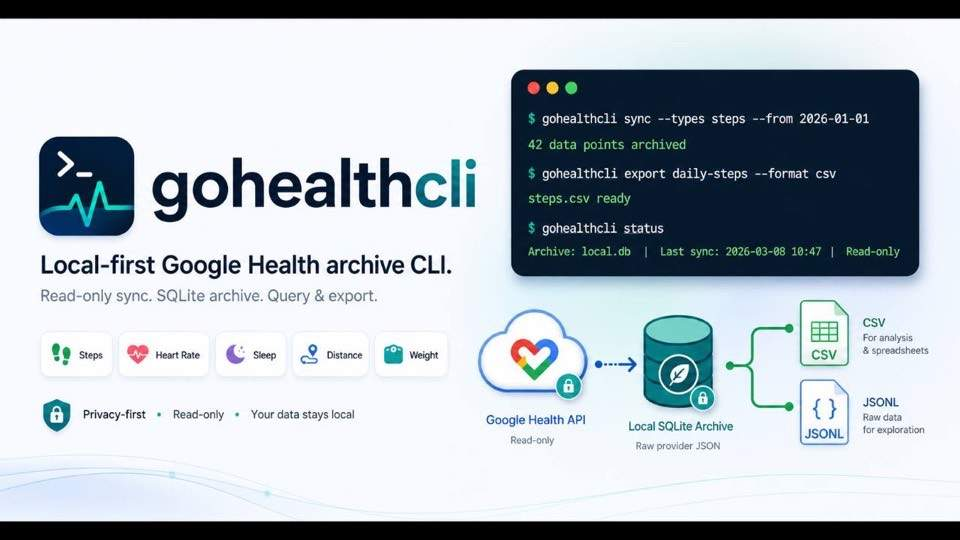

<p align="center">
  
</p>

# gohealthcli

[](https://github.com/BramVR/gohealthcli/actions/workflows/ci.yml)
[](https://pkg.go.dev/github.com/BramVR/gohealthcli)
[](https://goreportcard.com/report/github.com/BramVR/gohealthcli)

[](https://github.com/BramVR/gohealthcli)
[](https://gohealthcli.bramvanrompuy.be)

Local-first, read-only Google Health CLI — archive your Google Health data locally.

`gohealthcli` connects to the Google Health API, stores raw provider JSON in a
local SQLite archive, and provides scriptable commands for sync, status, query,
raw API exploration, and CSV/JSONL exports.

It is for local inspection and personal data archiving. It does not write health
data, delete health data, run a server, upload archives, or share exports.

## Status

The full command surface is live: setup (`init`, `doctor`), OAuth and
identity snapshots (`connect` through `irn-profile`), archiving (`sync`,
with heartbeat-backed `sync --status` observability and auto-fencing of
abandoned runs), raw provider exploration (`raw`), and a stable read
surface (`status`,
`query`, `export`, `describe-schema`) with predictable `--plain` /
`--json` contracts for scripted and LLM consumers (PRD #144). The Tier 1 daily + hydration catalog slice is
sealed, and CI runs gofmt, golangci-lint (`make lint`), build, tests, and the
command-reference drift
guard (`make docs-check`) on every pull request and push to `main`. The Command Registry in
`cmd/gohealthcli/commands.go` is the single source of truth for the user-facing
surface; the list below mirrors each entry's `Short` description and stays in
sync with `gohealthcli --help`.

- `init`: Create local config and an empty Health Archive.
- `doctor`: Validate local setup and provider reachability.
- `connect`: Run the browser OAuth flow and anchor one Google Identity.
- `identity`: Refresh the archived Google Identity metadata.
- `profile`: Archive a Profile Snapshot from the provider.
- `settings`: Archive a Settings Snapshot from the provider.
- `devices`: Archive a Paired Devices Snapshot from the provider.
- `irn-profile`: Archive an IRN Profile Snapshot from the provider.
- `sync`: Archive Google Health Data Points and supported Rollups.
- `status`: Summarise archive counts and newest synced timestamps.
- `query`: Run guarded read-only SQL over the Health Archive.
- `export`: Write a normalised dataset to CSV or JSONL.
- `raw`: Print raw provider JSON for endpoint exploration.
- `describe-schema`: Self-describe the Health Archive for LLM consumption.

The discoverability verbs added by PRD #143 cover the rest of the surface:

- `gohealthcli` with no arguments prints the same Subcommands block as
  `gohealthcli --help` to stdout and exits 0 — the binary never errors on a
  bare invocation.
- `gohealthcli help` and `gohealthcli help <command>` are alias verbs for
  `--help` / `<command> --help`, prepending the registry's long-form prose to
  the flag block on stderr.
- `gohealthcli --version` and `gohealthcli --version --json` print the
  build-stamped `version`, `commit`, and `built` identifiers; see
  [docs/commands/version.md](./docs/commands/version.md) for the shape.
- An unknown command prints `unknown command: <typo>` on stderr, a
  Levenshtein-2 "Did you mean" hint (at most two suggestions), and the
  canonical `Run 'gohealthcli --help' for a list of commands.` discovery
  line — see [docs/commands/help.md](./docs/commands/help.md).

Supported Data Point sync types (grouped by domain):

- Activity and fitness: `steps`, `distance`, `floors`, `altitude`,
  `active-energy-burned`, `active-minutes`, `active-zone-minutes`,
  `activity-level`, `sedentary-period`, `time-in-heart-rate-zone`,
  `vo2-max`, `run-vo2-max`, `daily-vo2-max`, `swim-lengths-data`.
- Heart rate: `heart-rate`, `heart-rate-variability`,
  `daily-resting-heart-rate`, `daily-heart-rate-variability`,
  `daily-heart-rate-zones`.
- Heart rhythm (Tier 2 opt-in scopes): `electrocardiogram`,
  `irregular-rhythm-notification`.
- Sleep and respiration: `sleep`, `oxygen-saturation`,
  `daily-oxygen-saturation`, `daily-respiratory-rate`,
  `respiratory-rate-sleep-summary`, `daily-sleep-temperature-derivations`.
- Exercise: `exercise`.
- Body measurements: `weight`, `body-fat`, `height`.
- Other biomarkers: `blood-glucose`, `core-body-temperature`.
- Hydration (nutrition.readonly scope): `hydration-log`.

`sync --source-family wearable` is available for Data Types backed by the
Google Health reconcile path. `sync --types steps --rollup daily` archives
steps daily Rollups. `total-calories` is known to the catalog but is not
supported by raw Data Point sync because Google exposes it as Rollup data;
`calories-in-heart-rate-zone` is also catalog-known but not yet implemented
because Google exposes it only through Rollup operations whose payload shape
is not pinned in gohealthcli yet.

With the Tier 2 `tcx` scope granted (`gohealthcli connect --add-scopes
tcx`), `exercise` sync also archives each session's TCX route file as a
`tcx`-kind Attachment under `<archive>.attachments/` (ADR-0009). Without
the scope, exercise Data Points still sync and the TCX step is skipped —
no failed provider call, no partial archive.

The drift guard in `internal/googlehealth/readme_sync_types_test.go`
(`TestREADMEListsEverySyncableDataType` and
`TestREADMECaveatListsCatalogTypesSyncRejects`) fails if a Data Type is
added to the Google Health catalog without a matching entry in the list
above or the caveat sentence.

For a plain-language description of each Data Type — what it captures,
the upstream record shape, required scope, and the normalized view it
projects into — see [docs/data-types.md](./docs/data-types.md).

Normalized export datasets. `gohealthcli export` accepts any of the
names below as its positional argument. The list is auto-generated from
`exportDatasetCatalogSingleton.Names()` by `make docs-export-datasets`;
the markers around the block are stable so the regenerator can rewrite
just the bullets without touching the surrounding prose.

<!-- export-datasets:start -->
- `active-minutes-intervals`
- `active-zone-minutes-intervals`
- `activity-level-intervals`
- `altitude-intervals`
- `blood-glucose-samples`
- `body-fat-samples`
- `core-body-temperature-samples`
- `current-height`
- `current-irn-profile`
- `current-settings`
- `daily-heart-rate-zones`
- `daily-sleep-temperature-derivations`
- `daily-steps`
- `daily-vo2-max`
- `electrocardiogram-sessions`
- `exercise-sessions`
- `exercise-splits`
- `floors-intervals`
- `heart-rate-samples`
- `height-samples`
- `hydration-log-sessions`
- `irregular-rhythm-notifications`
- `paired-devices`
- `respiratory-rate-sleep-summary`
- `resting-heart-rate-by-day`
- `run-vo2-max-samples`
- `searchable-text`
- `sedentary-period-intervals`
- `sleep-sessions`
- `sleep-stages`
- `swim-lengths-data-intervals`
- `time-in-heart-rate-zone-intervals`
- `vo2-max-samples`
- `weight-samples`
<!-- export-datasets:end -->

The drift guard in `cmd/gohealthcli/docs_export_datasets_test.go`
(`TestREADMEExportDatasetsBlockMatchesCatalog`) fails if the committed
block does not match a fresh regeneration; the companion
`TestREADMEListsEveryExportDataset` keeps the wider section honest.

## Install

With Homebrew:

```bash
brew install BramVR/tap/gohealthcli
gohealthcli --version
```

With Go:

```bash
go install github.com/BramVR/gohealthcli/cmd/gohealthcli@latest
gohealthcli --version
```

For local development:

```bash
git clone https://github.com/BramVR/gohealthcli.git
cd gohealthcli
go test ./...
go run ./cmd/gohealthcli --help
```

## Google Auth Setup

Google Health API access requires a Google Cloud project and OAuth setup.

In Google Cloud:

- Enable the Google Health API.
- Configure Google Auth Platform branding, audience, and data access.
- While unverified, keep the app in Testing and add your Google account as a
  test user.
- Add these Data Access scopes:
  - `https://www.googleapis.com/auth/googlehealth.profile.readonly`
  - `https://www.googleapis.com/auth/googlehealth.activity_and_fitness.readonly`
  - `https://www.googleapis.com/auth/googlehealth.health_metrics_and_measurements.readonly`
  - `https://www.googleapis.com/auth/googlehealth.sleep.readonly`
- Create an OAuth client with application type `Desktop app`.
- Download the client JSON.

The four scopes above cover the default Tier 1 surface. The Tier 2
features — the `settings`, `devices`, and `irn-profile` commands, the
`electrocardiogram`, `irregular-rhythm-notification`, and
`hydration-log` sync types, and TCX route archiving — each need an
extra opt-in scope granted with `gohealthcli connect --add-scopes`
(keywords: `ecg`, `irn`, `nutrition`, `settings`, `tcx`); without it
the provider returns HTTP 403. Add the matching optional scopes in
Google Cloud as well — the full scope-to-keyword table is in
[docs/google-auth-setup.md](./docs/google-auth-setup.md).

Do not use a Web application client. `gohealthcli` uses an installed-app
localhost callback flow and rejects web-client JSON.

Keep the downloaded OAuth client JSON owner-only:

```bash
chmod 600 ~/Downloads/client_secret_*.json
```

## Quick Start

Initialize local config and archive:

```bash
gohealthcli init --oauth-client-file ~/Downloads/client_secret_*.json
gohealthcli doctor --plain
```

Connect in the browser and verify the connection:

```bash
gohealthcli connect --plain
gohealthcli doctor --online --plain
gohealthcli identity --plain
gohealthcli profile --plain
```

Sync a small window first:

```bash
gohealthcli sync --types steps --from 2026-01-01 --to 2026-01-02 --plain
gohealthcli status --plain
```

Watch a long sync from another terminal (or an agent) while it runs:

```bash
gohealthcli sync --status
gohealthcli sync --status --window 2h --json
```

`sync --status` reads the local `sync_runs` audit table — no provider calls.
Every Sync Run heartbeats before each page fetch (counts so far plus
`last_progress_at`), so in-flight rows show live progress; finished runs are
listed inside the `--window` (default 15m, max 24h) while running rows never
age out of view. On entry, `sync`, `sync --status`, and `status` fence
abandoned runs: a `sync_running` row with no heartbeat for 5 minutes flips to
`sync_failed` with `error_summary='abandoned (no heartbeat for 5m)'`, and the
Sync Cursor stays put so the next run re-reads the same window.

How long does a sync take? Cursor-resumed incremental syncs finish in
seconds. Explicit backfills cost time in proportion to Data Point count —
sustained throughput measures roughly 2,000–5,000 Data Points/minute on
real runs (plan with ~2,000/min) — so the Data Type's density decides the
wall-clock. Densities measured 2026-06-10 from a real archive backed by a
Pixel Watch 4 (continuous heart-rate sampling), and what two weeks of
data costs. A Data Point is the upstream record unit, which is why the
counts differ so wildly per type: a heart-rate point is a single reading
(every ~3 seconds on the watch), a steps point is a one-minute bucket,
and a sleep point is an entire night with its stage breakdown.

| Data Type                 | Density (points/day) | Two weeks ≈  | Sync time ≈              |
| ------------------------- | -------------------- | ------------ | ------------------------ |
| `heart-rate`              | ~27,500              | ~385,000 pts | 1.5–3 h                  |
| `time-in-heart-rate-zone` | ~960                 | ~13,400 pts  | ~5 min                   |
| `active-energy-burned`    | ~630                 | ~8,800 pts   | ~4 min                   |
| `oxygen-saturation`       | ~480                 | ~6,700 pts   | ~3 min                   |
| `steps`                   | ~260                 | ~3,600 pts   | ~2 min                   |
| `sleep`, `daily-*` types  | ~1                   | ~14 pts      | seconds                  |

Density is account-specific — a phone-only account with no
continuously-sampling wearable runs far lower. Long runs survive OAuth
token expiry: a mid-run 401 triggers a single token refresh and a retry
of the failed page, so a multi-hour heart-rate backfill can run as one
`--from`/`--to` window in the standard `init --oauth-client-file` setup.
Watch long runs from another terminal with `sync --status`. The full
per-type table covering every measured Data Type is in
[docs/data-types.md](./docs/data-types.md).

Archive daily step Rollups or wearable-filtered Data Points when needed:

```bash
gohealthcli sync --types steps --rollup daily --from 2026-01-01 --to 2026-01-31 --plain
gohealthcli sync --types heart-rate --source-family wearable --from 2026-01-01 --to 2026-01-02 --plain
```

Export normalized daily steps:

```bash
gohealthcli export daily-steps --format jsonl --stdout
gohealthcli export daily-steps --format csv --output steps.csv
```

Explore raw provider JSON:

```bash
gohealthcli raw endpoint getIdentity
gohealthcli raw data-type steps --from 2026-01-01 --to 2026-01-02
```

Query the local archive:

```bash
gohealthcli query --plain 'SELECT data_type, COUNT(*) FROM data_points GROUP BY data_type'
```

Command flags must appear before the SQL argument because Go flag parsing stops
at the first positional argument.

Use `gohealthcli <command> --help` or `gohealthcli help <command>` for
command-specific flags.

## Global flags

These flags apply to the top-level invocation and (where the subcommand
accepts them) to the per-subcommand parse. The shared set is the contract
captured by the Common Flag Set module in
[`cmd/gohealthcli/common_flags.go`](./cmd/gohealthcli/common_flags.go):

- `--config <path>`: config file path.
- `--db <path>`: SQLite Health Archive path.
- `--json`: write stable JSON to stdout.
- `--plain`: write plain key/value output to stdout.
- `--no-input`: never prompt, never wait for browser input.
- `--version`: print the build-stamped version line and exit (top level only).

`--plain` and `--json` are mutually exclusive — passing both exits non-zero
with a `flag_invalid` failure envelope ("`--plain and --json are mutually
exclusive`"). The check fires for `--version` too, so
`gohealthcli --plain --json --version` is rejected before any output is
written.

A few subcommands deviate from the standard `--plain` / `--json`
contract:

- `describe-schema` always emits the curated JSON catalog (or live DDL when
  `--sql` is passed). Its own `--json` flag is on by default; the global
  `--json` / `--plain` are accepted and parsed but have no effect on the
  schema bytes. Its *failure* envelopes do route through the Failure
  Reporter, so `gohealthcli --json describe-schema bogus` lands a JSON
  failure on stdout like every other subcommand.
- `export` always writes CSV (default) or JSONL according to its
  `--format` flag, and treats `--plain` / `--json` as format synonyms
  rather than output-mode switches: `--json` means `--format jsonl` and
  `--plain` means `--format csv`. Passing a synonym alongside a
  contradictory `--format` value (`--json --format csv`) fails with a
  "`--json conflicts with --format csv`" error. Failure envelopes do
  honour the requested mode — `export <dataset> --json` reports failures
  as a JSON envelope, `--plain` as plain key/value lines. See
  [docs/commands/export.md](./docs/commands/export.md).
- `raw` writes the provider's raw bytes to stdout and ignores `--plain`,
  `--json`, and `--no-input`; passing any of them directly on `raw` is
  rejected at parse time with a targeted "not supported by raw" message.

## Read surface

The four read commands — `status`, `query`, `export`, `describe-schema` —
are the primary interface for LLM consumers and scripted users. PRD #144
made the contract predictable across them; the notes below summarise the
behaviour that is now stable. See each command's reference page under
[docs/commands/](./docs/commands/) for the full prose.

- `--db <path>` works on its own for every read command. Passing
  `gohealthcli --db /tmp/scratch.sqlite status` opens that archive
  directly without requiring a matching `--config` file. When only
  `--db` is explicit it wins without an agreement check; when both
  `--config` and `--db` are explicit and disagree, the error names
  `--db` and `--config` rather than the internal `archive_path` field.
  `describe-schema --db` is honoured the same way (PRD #144 slice 1).
- `status --plain` and `status --json` carry the same information. The
  plain `known_data_types: a,b,c` line maps to a top-level
  `known_data_types` JSON array; `paired_device_count` is a top-level
  JSON key as well as the back-compat nested
  `identity_snapshots_freshness.paired_device_count`. A consumer who
  picks one mode never loses fields the other mode carries (PRD #144
  slice 9).
- `query` with no flags emits the same `row.<row>.<column>: <value>`
  shape as `--plain` — the legacy `Row N: column=value column=value`
  output (which silently broke on values containing spaces or `=`) was
  removed in PRD #144 slice 7. Scripted and LLM consumers get a
  parseable shape by default.
- `query --json` returns JSON-typed columns (`raw_json`,
  `data_source_json`, `timezone_metadata`, `token_metadata_json`,
  `google_identity_json`, and any column whose name ends in `_json`) as
  nested JSON objects so downstream consumers parse once instead of
  twice. Pass `--raw-text` to opt out. BLOB columns are wrapped in a
  `{"__blob_base64__": "<base64>"}` marker object so raw bytes survive
  the JSON path without UTF-8 corruption (PRD #144 slices 5–6).
- `export --help` lists every supported dataset alphabetically (PRD #144
  slice 3). The full list is auto-generated above between the
  `<!-- export-datasets:start -->` / `<!-- export-datasets:end -->`
  markers from the same registry (PRD #144 slice 4). `export <typo>`
  surfaces the closest matches (Levenshtein ≤ 3, top 3) and a pointer
  back to `export --help`.
- `describe-schema --json` reports view column types as the literal
  `"unknown"` rather than a misleading `BLOB` or empty string when the
  underlying expression's affinity does not carry a declared type.
  Table columns still report their declared types — the fallback is
  view-only (PRD #144 slice 8).

## Configuration

Default local paths:

- config: `~/.config/gohealthcli/config.toml`
- archive: `~/.local/share/gohealthcli/gohealthcli.sqlite`

Default runtime token storage is OS-native:

- macOS: Keychain
- Windows: Windows Credential Manager
- Linux: Secret Service/libsecret

For local testing, an explicit file Credential Store is acceptable if it stays
owner-only. There is no default file path — a `type = "file"` store must set
`path` explicitly (a conventional location is
`~/.config/gohealthcli/tokens.json`):

```toml
[credential_store]
type = "file"
path = "/absolute/path/to/gohealthcli/tokens.json"
```

Use `doctor --plain` to check local setup without provider calls. Use
`doctor --online --plain` only when you want token refresh and Google Health
reachability checks.

## Safety

- Read-only provider behavior: no health writes or deletes.
- Local-first archive: no cloud service and no background upload.
- OAuth token values are not printed in normal command output.
- OAuth endpoints from the client JSON are pinned to https Google hosts,
  and the client file must stay owner-only — enforced both at `connect`
  and on the token auto-refresh path.
- Exports can reveal health history; commands require explicit `--stdout` or
  `--output`, and `export` refuses to write through a symlinked `--output`.
- `query` and `status` plain output escapes control characters, so archived
  provider data cannot inject terminal escape sequences.
- Data Point Attachment paths are validated against path traversal before
  they are joined to the attachments root.
- Keep the SQLite archive, token files, and exported CSV/JSONL files private.

## Release

Tagged releases publish GitHub Release archives and update the Homebrew tap.
Install with:

```bash
brew install BramVR/tap/gohealthcli
```

Release operators: see [docs/release.md](./docs/release.md).

## Docs

- [Project Site](https://gohealthcli.bramvanrompuy.be): rendered install,
  quickstart, Data Types, and command reference pages.
- [CONTEXT.md](./CONTEXT.md): project glossary only, used by grill-style review.
- [docs/google-auth-setup.md](./docs/google-auth-setup.md): local Google
  Health OAuth setup checklist.
- [docs/commands.md](./docs/commands.md): CLI surface and output behavior.
- [docs/data-model.md](./docs/data-model.md): archive model sketch.
- [docs/security.md](./docs/security.md): local credentials and health data safety.
- [docs/research.md](./docs/research.md): source-backed Google Health API notes.
- [docs/plan.md](./docs/plan.md): product and implementation plan.
- [docs/adr/](./docs/adr): short architectural decision records.
